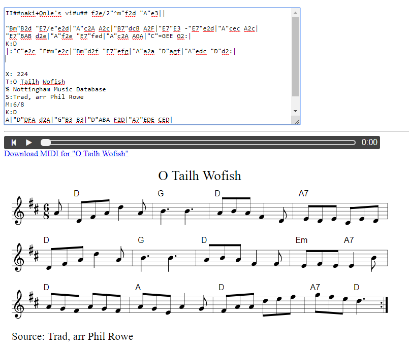
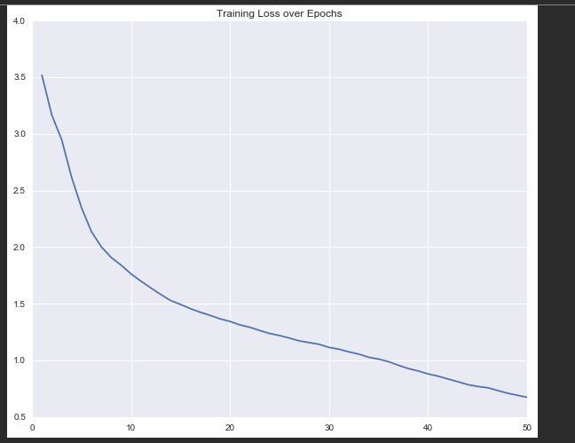
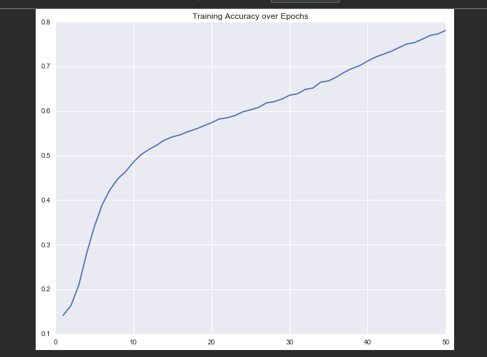

# char-rnn-keras

Multi-layer recurrent neural networks for training and sampling from texts, inspired by [karpathy/char-rnn](https://github.com/karpathy/char-rnn).

### Requirements

This code is written in Python 3, and it requires the [Keras](https://keras.io) deep learning library.

### Description
* 3 LSTM layer each with 256 units.
* 1 Embedding layer top of LSTM to embedd the every character as dense neuron.
* Stateful=True in LSTM to make long term dependency in each every character.
* Dataset :: Nottingham Music Database

**Model Detail**
```markdown
Layer (type)                 Output Shape              Param #   
=================================================================
embedding_1 (Embedding)      (16, 64, 512)             44032     
_________________________________________________________________
lstm_1 (LSTM)                (16, 64, 256)             787456    
_________________________________________________________________
dropout_1 (Dropout)          (16, 64, 256)             0         
_________________________________________________________________
lstm_2 (LSTM)                (16, 64, 256)             525312    
_________________________________________________________________
dropout_2 (Dropout)          (16, 64, 256)             0         
_________________________________________________________________
lstm_3 (LSTM)                (16, 64, 256)             525312    
_________________________________________________________________
dropout_3 (Dropout)          (16, 64, 256)             0         
_________________________________________________________________
time_distributed_1 (TimeDist (16, 64, 86)              22102     
_________________________________________________________________
activation_1 (Activation)    (16, 64, 86)              0         
=================================================================
Total params: 1,904,214
Trainable params: 1,904,214
Non-trainable params: 0
_________________________________________________________________
```
ABC notation is a shorthand form of musical notation. In basic form it uses the letters A through G, letter notation, to represent the given notes, with other elements used to place added value on these – sharp, flat, the length of the note, key, ornamentation. 
To learn more about char ABC Notation in https://en.wikipedia.org/wiki/ABC_notation

The mechanics of the text generation uses a Char-RNN based generator, which learn about the pattern about characters appear of the char ABC notation in Music.
When it is trained then, it will able to generate the music char abc notation which seems to new compose music that the network learn.

**How this model learn? For more details read Andrej Karpathy Blog Post [The Unreasonable Effectiveness of Recurrent Neural Networks](http://karpathy.github.io/2015/05/21/rnn-effectiveness/)**

I found the following helpful database.
# Dataset
#### Irish Folk Music 

As a lover of folk tunes, particularly Irish tunes, I found these datasets immensely helpful.
- **O'Neill's Irish Music dataset** (Source: http://trillian.mit.edu/~jc/music/book/oneills/1850/X/ )
- **Cobb's Irish Music dataset** (Source: http://cobb.ece.wisc.edu/irish/Tunebook.html )
- **Nottingham Music dataset** (ABC version of Nottingham music dataset: http://abc.sourceforge.net/NMD/)
### Usage

All input data should be placed in the `data/` directory. The example `input.txt` is taken from the [Nottingham Dataset (Cleaned)](https://github.com/jukedeck/nottingham-dataset).

To train the model with default settings:
```bash
$ python train.py
```

To sample the model:
```bash
$ python sample.py 100
# where 100 no of character to generate
```

To visualize the Loss and Accuracy, see:
```bash
Visualization.ipynb
```
Training loss/accuracy is stored in `logs/training_log.csv`.

### Sample run
```markdown
$ python sample.py

# output 

II##naki+Qnle's vi#u## f2e/2"^m"f2d "A"e3||

"Bm"B2d "E7/e"e2d|"A"c2A A2c|"B7"dcB A2F|"E7"E3 -"E7"e2d|"A"cec A2c|
"E7"BAB d2e|"A"f2e "E7"fed|"A"c2A AGA|"C"=GEE G2:|
K:D
|:"C"e2c "F#m"e2c|"Bm"d2f "E7"efg|"A"a2a "D"agf|"A"edc "D"d2:|


X: 224
T:O Tailh Wofish
% Nottingham Music Database
S:Trad, arr Phil Rowe
M:6/8
K:D
A|"D"DFA d2A|"G"B3 B3|"D"ABA F2D|"A7"EDE CED|
"D"DFA d2A|"G"B3 B3|"D"ABA F2F|"Em"EFE "A7"E2B|
"D"AGF AGF|"A"AGE A2G|"D"FAA def|"A7"gfe "D"d3:|

```
Above output is copy on [abcjs-editor](https://abcjs.net/abcjs-editor.html)  which run the char-ABC notation in music [MIDI](https://en.wikipedia.org/wiki/MIDI) format.

The output seen as:



[midi_music](image/o_tailh_wofish.midi) in dir `image/` 


## Accuracy and Loss of Model

 

